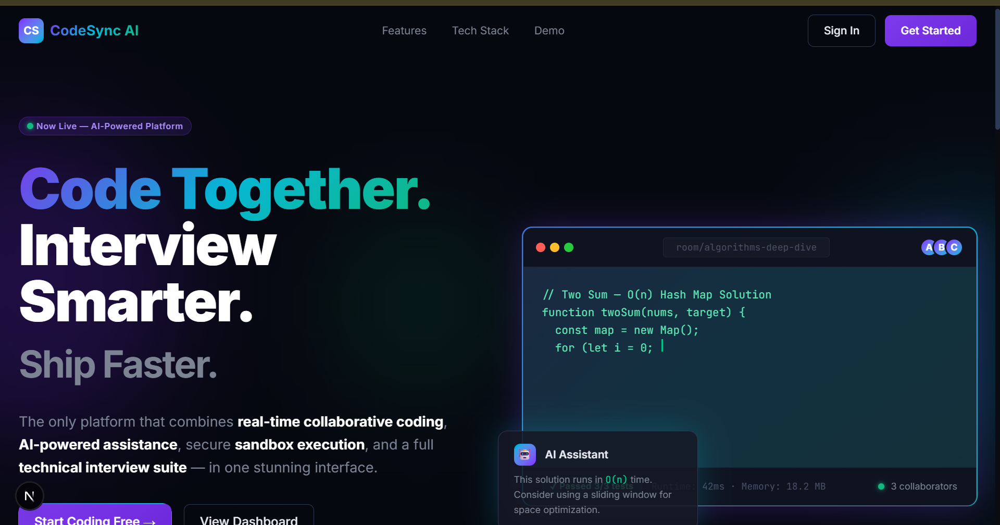
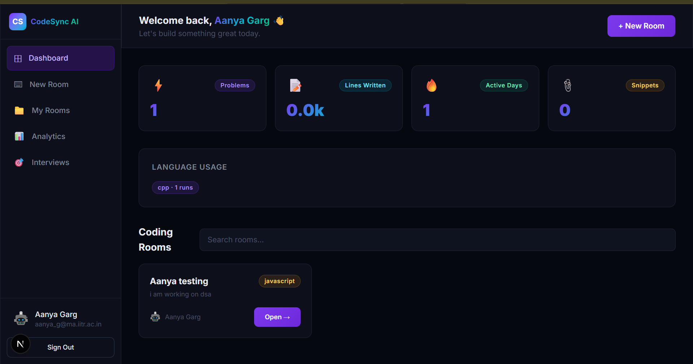
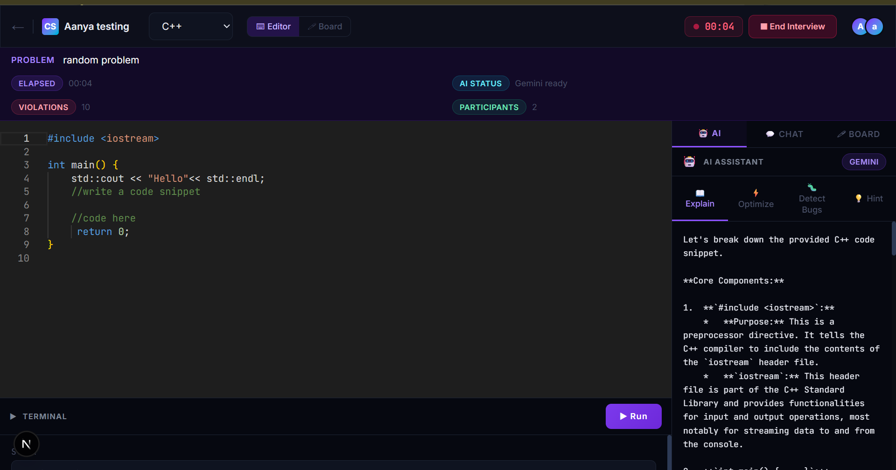
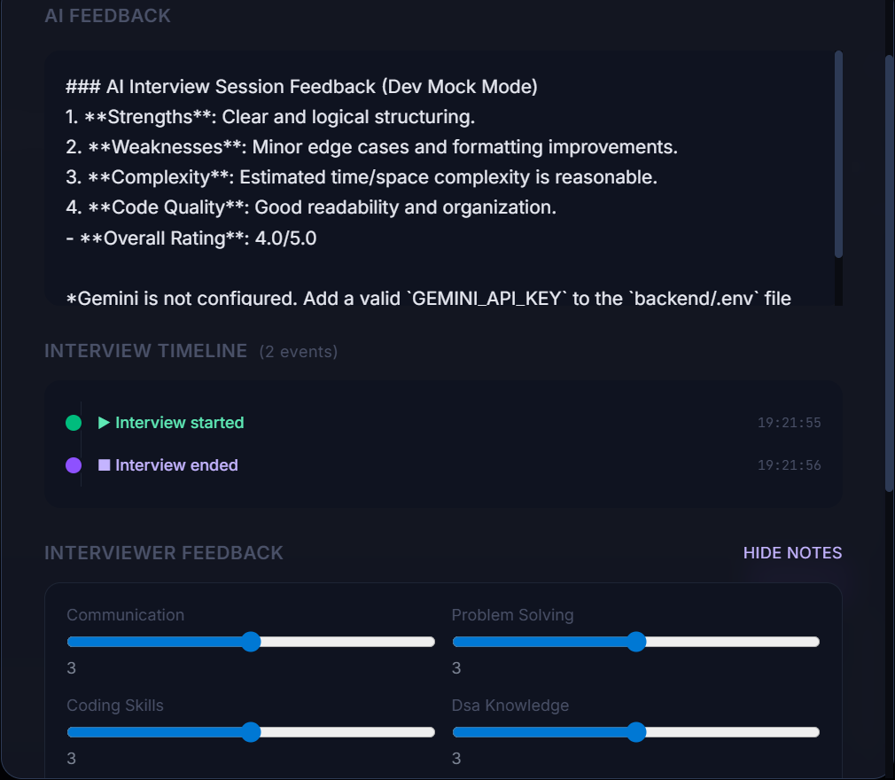
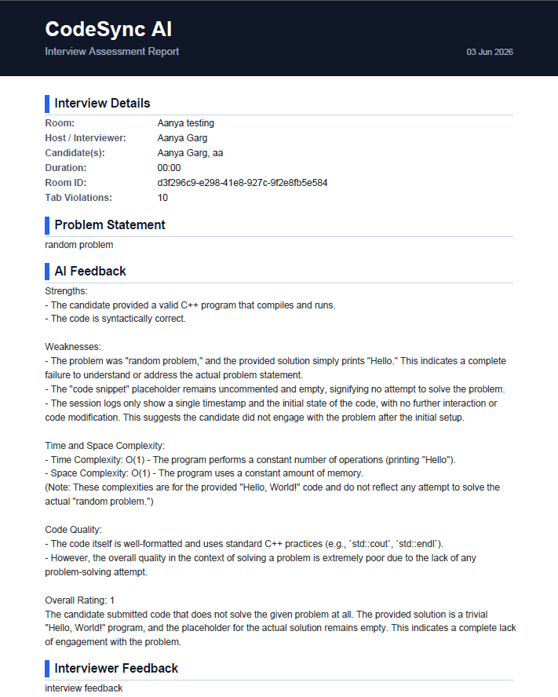

# CodeSync AI

CodeSync AI is a collaborative coding interview platform designed to simulate real-world technical interviews in a shared environment. It combines a real-time collaborative code editor, whiteboard, interview monitoring tools, session tracking, timeline analysis, and AI-powered feedback generation to create a complete interview experience for both interviewers and candidates.

The goal of this project is to provide a smooth and transparent technical interview workflow while helping interviewers evaluate candidates effectively through live collaboration and automated reporting.

---

## Features

### Authentication

- User registration and login
- Protected routes using authentication guards
- Secure session-based access control

### Real-Time Collaborative Coding

- Shared Monaco Editor
- Multiple users can code simultaneously
- Real-time synchronization using Socket.IO and Yjs
- Support for multiple programming languages

### Interview Rooms

- Create and join interview rooms
- Dedicated interviewer and candidate roles
- Live participant tracking
- Interview session timer

### Collaborative Whiteboard

- Real-time shared drawing canvas
- Adjustable brush colors and sizes
- Instant synchronization across users

### Interview Monitoring

- Interview start and end tracking
- Browser tab-switch detection
- Focus loss monitoring
- Violation logging

### Timeline Tracking

Records important interview events including:

- Interview started
- Interview ended
- Tab-switch violations
- User activity updates

### AI Feedback Generation

After an interview, the platform generates:

- AI-generated interview summary
- Candidate performance analysis
- Strengths and weaknesses
- Overall rating and feedback

### Report Generation

Export interview reports in:

- PDF format
- JSON format

Reports contain:

- Interview details
- Problem statement
- Participant information
- Timeline events
- Tab-switch violations
- AI-generated feedback
- Interviewer feedback
- Final code submission

---

# Screenshots

## Front Page



The landing page introduces the platform and provides authentication options for users.

---

## Dashboard



The dashboard allows users to create interview rooms, manage sessions, and view interview analytics.

---

## Interview Room



A real-time collaborative coding environment featuring Monaco Editor, participant tracking, chat, and synchronized editing.

---

## Interview Timeline



Tracks important interview events such as session start, session end, and tab-switch violations.

---

## Generated Report



Professional PDF reports containing AI feedback, interviewer comments, ratings, timeline events, and interview summaries.

---

## Tech Stack

### Frontend

- Next.js
- React
- TypeScript
- Tailwind CSS
- Monaco Editor
- Socket.IO Client
- Yjs

### Backend

- Node.js
- Express.js
- TypeScript
- Socket.IO
- Prisma ORM

### Database

- PostgreSQL

### AI Integration

- AI-powered interview evaluation and feedback generation

---

## Project Structure

```text
codesync-ai/
│
├── frontend/
│   ├── src/
│   ├── public/
│   ├── package.json
│   └── .env.local
│
├── backend/
│   ├── src/
│   ├── prisma/
│   ├── package.json
│   └── .env
│
├── screenshots/
│   ├── frontpage.png
│   ├── dashboard.png
│   ├── room.png
│   ├── timeline.png
│   └── report.png
│
└── README.md
```

---

## Installation

### Clone the Repository

```bash
git clone <repository-url>
cd codesync-ai
```

---

## Backend Setup

Navigate to the backend directory:

```bash
cd backend
npm install
```

Create a `.env` file:

```env
DATABASE_URL=your_database_url
JWT_SECRET=your_secret_key
PORT=5000
```

Run Prisma migrations:

```bash
npx prisma migrate dev
```

Start the backend server:

```bash
npm run dev
```

---

## Frontend Setup

Navigate to the frontend directory:

```bash
cd frontend
npm install
```

Create a `.env.local` file:

```env
NEXT_PUBLIC_API_URL=http://localhost:5000
```

Start the frontend application:

```bash
npm run dev
```

---

## Usage

### Creating an Interview

1. Login to the platform.
2. Create a new interview room.
3. Share the room link with participants.
4. Start the interview session.
5. Monitor coding activity and whiteboard collaboration.

### Conducting the Interview

1. Discuss the problem statement.
2. Observe live coding progress.
3. Use the collaborative whiteboard when required.
4. Monitor tab-switch violations.
5. End the interview session.

### Reviewing Results

After ending the interview:

- View AI-generated feedback
- Add interviewer comments
- Review timeline events
- Download PDF reports
- Download JSON reports

---

## Future Improvements

Planned enhancements include:

- Room password protection
- Integrated video and audio communication
- Secure code execution sandbox
- Plagiarism detection
- AI-generated interview question recommendations
- Advanced interview analytics dashboard
- Company-specific interview templates
- Session recording and playback

---

## Challenges Faced

Some of the major challenges encountered during development were:

- Real-time synchronization conflicts
- Collaborative editor state management
- Socket disconnection handling
- Interview session persistence
- Structured report generation
- Maintaining low-latency communication across participants

---

## Learning Outcomes

This project provided practical experience in:

- Real-time systems development
- WebSocket communication
- Collaborative application design
- Database modeling using Prisma
- Authentication and authorization
- Full-stack TypeScript development
- AI integration into web applications
- Report generation and session analytics

---

## Author

**Aanya Garg**  
BS-MS Applied Mathematics and Scientific Computing  
Indian Institute of Technology Roorkee

---

## License

This project is developed for educational, research, and learning purposes.
